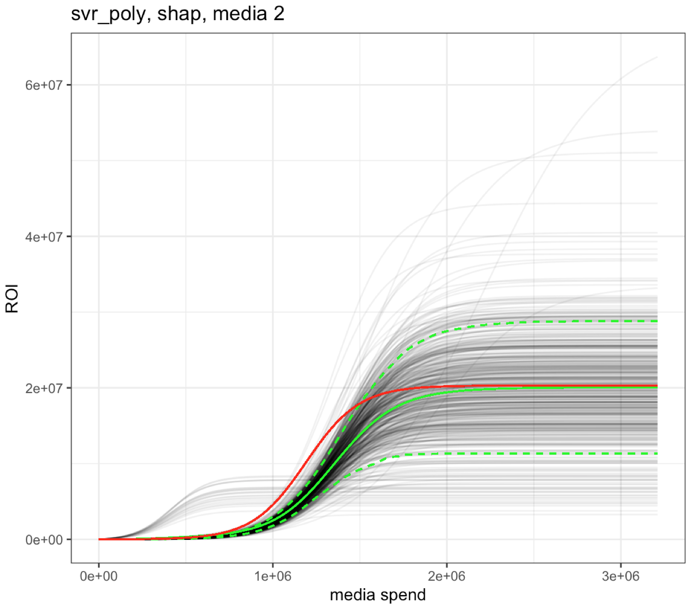

# Scripts for Master Thesis

**Sales Modeling and Local Factor Decomposition for Optimal Investment Decisions in MMM**

A Monte Carlo Simulation Study

# Workflow
The central file which implements the iterations of the Monte Carlo study is called **master_simulation_loop.R**. It is recommended to open this script and go through the residual ones in chronological order. All the scripts start with a description and mention the required inputs. The master_simulation_loop.R file is run for both the original and alternative simulation specification. The paths and the conditionals have to be adjusted manually (= substitute .regular with .extreme where necessary and set F to T for the respective scripts in order to generate data for the robustness checks...)!

1. master_simulation_loop.R         = bla
2. simulation_1.R                   = blu

# Reproducability
The full output of the thesis is reproducable with these scripts with the exemption of **real_data_exploration_calibration.R** which requires the `SeasonTrendProphet` function (which is third partie's software property). However, this script is not required for reproducability of the results. It is only required for the calibration process which guided our parameter choice in other scripts.
